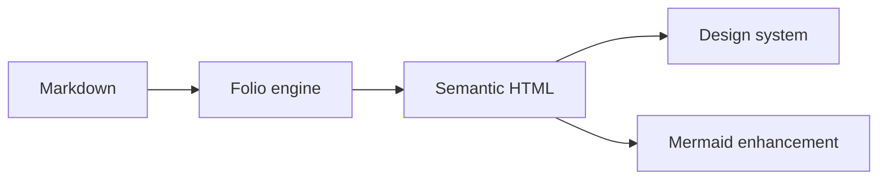

Folio 的文档页面直接使用 `FolioMarkdown`。这页就是运行时能力的 dogfood。

::: tip
`FolioApp` 与 consumer 直接使用同一个 `renderFolioMarkdown()` contract，不再各自调用 `marked.parse()`。
:::

::: warning
Mermaid 使用 `securityLevel: strict`。渲染失败时不会吞掉内容，而是保留可读源码。
:::

## GFM 表格

| 能力 | 状态 |
| --- | --- |
| GFM table | 内置 |
| Syntax highlight | highlight.js |
| Mermaid | 浏览器端动态增强 |
| Callout | tip / info / note / warning / danger |

## 代码高亮

```ts
export function hello(name: string) {
  return `Hello, ${name}`;
}
```

## Mermaid



## 失败语义

Mermaid 是 progressive enhancement：HTML 中始终先保留源码 fallback；浏览器加载 Mermaid 成功后再替换为 SVG。
